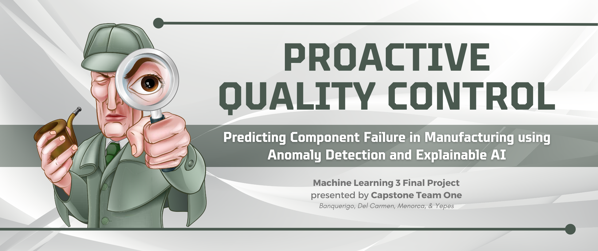

The continuous advancement of technology paves the way for the progression we see in a lot of industries nowadays – from healthcare, transportation, and manufacturing, to name a few. If they are ideal or determinist is irrelevant to this discussion. In this blog, we take a look at manufacturing industries, explore the challenges they are facing, and experiment with today’s state-of-the-art machine learning and artificial intelligence technologies which we think can help with those challenges.

In manufacturing industries, or any industry for that matter, quality assurance and control is one of the most vital parts of the process. It ensures that the goods, products, and/or services that go into stock and are delivered/provided to customers achieve the highest level of quality possible. Such quality is achieved by ensuring these deliverables meet a certain level of standard, and never go below a certain threshold. However, for manufacturing industries, ensuring such quality can be a challenging task because of four distinct reasons [(Zou, et. al., 2022)](https://www.ecva.net/papers/eccv_2022/papers_ECCV/papers/136900389.pdf).

1. *Rarity.* In a production line, defects are rare to come by, which is both a good thing and a bad thing. It is a good thing because manufacturers want a high yield in terms of production. Defining what makes a good or a product bad, however, can be challenging as there are only a few to study from and associate patterns with.
2. *Scale.* Rarity can be more daunting when coupled with the second challenge which is the usual size of these defects which can be as small as millimeters or microns.
3. *Sensitivity.* The rarity and scale challenges make the manufacturing industry performance sensitive which requires highly accurate models to automate the defect detection process.
4. *Spectrum.* The automation is also a challenge as manufacturing industries have a wide range of domains or tasks, spanning components of all sizes and of different quality requirements.

These challenges pose a threat to the manufacturing industry, especially in the Philippines, where the industry is currently thriving. The semiconductor manufacturing industry in the Philippines has been silently dominating the country’s value of export. In 2022, 83% of the total export value from the country’s top commodity groups came from electronics products, beating out other minerals and other manufactured goods [(PSA, 2022)](https://psa.gov.ph/content/highlights-philippine-export-and-import-statistics-august-2022-preliminary). This was also a 40% jump in export value from the 2021 figures. Of these electronic products, 47.4% accounted for semiconductors, with an equivalent export value of 1.6 trillion pesos (or $28.7B) [(Statista, 2022)](https://www.statista.com/statistics/1264606/philippines-export-share-of-semiconductors). A simple miscalculation in quality equates to millions of pesos in losses which is not ideal for a business. Thus, it is imperative to create a system for early prediction and prevention of component defects in manufacturing processes.

<div style="background-color:#4a594f; padding: 1px;"> </div>

<h1 style="background-color:#4a594f;color:#ffffff;padding:20px">What We Wanted</h1>

But how exactly do we create such a system that can accurately detect anomalies and make such detection interpretable, and be a guide for corrective action for the quality process? The team believes that these challenges, in the same level of difficulties faced by everyday rustics and elites, can be solved by leveraging the use of machine learning and the advancement in artificial intelligence (AI) works. The problems of defect data rarity, the scale of these defects, required model accuracy, and the wide spectrum of domains can be answered by combining concepts of advanced data mining, deep learning techniques, and explainable AI which can be used in the quality management of manufacturing industries.

<span style="color:#4a594f; font-size:18px"><i>Advanced Data Mining</i></span>

One of the concepts under advanced data mining is outlier detection. What is an outlier? An outlier is a data point exemplifying significant deviations from usual patterns or expected behaviors. Such a concept can be applied to anomaly detection, identifying defects of an object, in this case, a manufacturing product, as an outlier from a set of determined normal patterns.

The challenge in anomaly detection, a growing area of research in computer vision [(Gudovskiy, 2021)](https://arxiv.org/pdf/2107.12571.pdf), is almost aligned with those challenges faced by manufacturing industries such as anomalies usually being rare (rarity) and having a low probability to be acquired by sensors (scale). Thus, such limitations to the concept can be augmented by leveraging the use of deep learning techniques and explainable AI kits.

<span style="color:#4a594f; font-size:18px"><i>Deep Learning and Explainable AI</i></span>

The team is working with a sponsor which experiences the same challenges if not more than the challenges presented. In line with their attempt to implement deep learning techniques to do anomaly detection on images, we did some research about these deep learning techniques that combine image classification, object recognition, and anomaly detection/segmentation. Some of the techniques we have seen are unsupervised anomaly detection and localization models such as Patch Distribution Model (PaDiM) and Conditional Normalizing Flows for Anomaly Detection (CFLOW-AD).

<span style="background-color:#4a594f; color:#ffffff; font-size:15px; padding:10px"><i>PaDiM</i></span>

This is a ranking-based framework that concurrently detects and localizes anomalies in images in a one-class learning setting. It consists of two properties: (1) *patch embedding*, which is determined using a pre-trained convolutional neural network (CNN), and (2) *probabilistic representation of the normal class*, which is calculated using multivariate Gaussian distributions [(Defard, et. al, 2020)](https://arxiv.org/pdf/2011.08785.pdf). This means the framework has two steps in aiding anomaly detection and localization namely embedding extraction and learning of the normality.

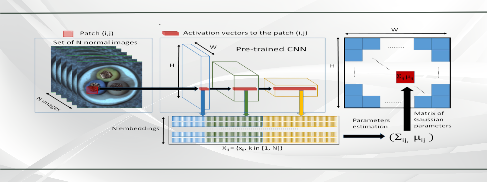
<div>
    <p style="font-size:10px;font-style:default;text-align:center">
        <b>Image 1. Overview of PaDiM.</b><br>
    </p>
</div>

The diagram, lifted from the [Defard, et. al. study (2020)](https://arxiv.org/pdf/2011.08785.pdf), provides an overview of the PaDiM mechanism. The proponents describe the mechanism as follows:
> For each image patch corresponding to a position in the largest CNN feature map, PaDiM learns the Gaussian parameters from the set of N training embedding vectors, computed from N different training images and three different pre-trained CNN layers.

<span style="background-color:#4a594f; color:#ffffff; font-size:15px; padding:10px"><i>CFLOW-AD</i></span>

This is a real-time model based on conditional normalizing flow framework adopted for anomaly detection with localization [(Gudovskiy, 2021)](https://arxiv.org/pdf/2107.12571.pdf). This model also consists of two properties: (1) *feature extraction* through a CNN encoder mechanism and (2) *likelihood estimation* through a conditional normalizing flow network decoder.

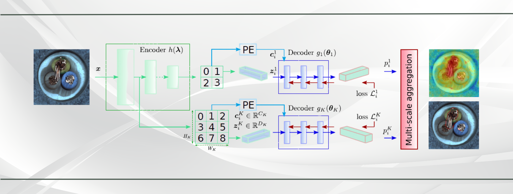
<div>
    <p style="font-size:10px;font-style:default;text-align:center">
        <b>Image 2. Overview of CFLOW-AD.</b><br>
    </p>
</div>

The diagram, lifted from the [Gudovskiy, et. al. study (2021)](https://arxiv.org/pdf/2107.12571.pdf), provides an overview of the CFLOW-AD mechanism. The proponents describe the mechanism as follows:
> The encoder is a CNN feature extractor with multi-scale pyramid pooling, which capture both global and local semantic information with the growing top-to-bottom receptive fields. Pooled feature vectors are processed by a set of decoders independently for each k-th scale. The decoder is a conditional normalizing flow network with a feature input and a conditional input, with spatial information form a positional encoder. The estimated multi-scale likelihoods are unsampled to the input size and added up to produce anomaly map.

Both of these models are trained through ResNet-18, an 18-layer residual learning network [(He, et. al., 2015)](https://arxiv.org/pdf/1512.03385v1.pdf) [(Abhishek, 2022)](https://ijcrt.org/papers/IJCRT2205235.pdf), which learns residual functions with reference to the layer inputs. If you want to read more about PaDiM and CFLOW-AD, and the ResNet-18 backbone to be used in this study, you can access the following papers through these links: [PaDiM](https://arxiv.org/pdf/2011.08785.pdf), [CFLOW-AD](https://arxiv.org/pdf/2107.12571.pdf), and [ResNet](https://ijcrt.org/papers/IJCRT2205235.pdf).

<span style="background-color:#4a594f; color:#ffffff; font-size:15px; padding:10px"><i>OpenVino</i></span>

In addition to the above models, one other model that can aid through the interpretability of anomaly detection is Open Visual Inference and Neural Network Optimization (OpenVINO), which focuses on optimizing neural network inferences [(Meel, n.d.)](https://viso.ai/computer-vision/intel-openvino-toolkit-overview/).

These three models are included in Anomalib, a library for benchmarking, developing, and deploying deep-learning anomaly detection algorithms. It is a deep learning library that aims to collect anomaly detection algorithms for benchmarking on various datasets, providing ready-to-use implementations of anomaly detection algorithms as referred from their literature of origin [(Github, n.d.)](https://github.com/openvinotoolkit/anomalib) used primarily for experiment management, hyperparameter optimization, and edge inference.

Getting started with `anomalib` by using `pip install`:

```python
pip install anomalib
```

Importing pertinent libraries such `anomalib` to get started:

```python
from pathlib import Path

from anomalib.data.utils import read_image
from anomalib.deploy import OpenVINOInferencer
from pytorch_lightning import Trainer
from pytorch_lightning.callbacks import ModelCheckpoint

import os
from PIL import Image
```

<div style="background-color:#4a594f; padding: 1px;"> </div>

<h1 style="background-color:#4a594f;color:#ffffff;padding:20px">What We Did</h1>

In order to test our hypothesis, the team experimented on the two aforementioned models and the inference model to a dataset of images, evaluated the results, and finally compared them to the results from the [Zou, et. al. study (2022)](https://www.ecva.net/papers/eccv_2022/papers_ECCV/papers/136900389.pdf). An overview of the steps is shown below, which include data collection, data preparation, feature extraction, model training, model evaluation, and inference.

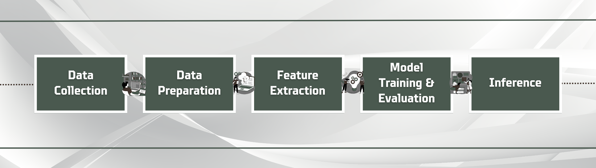
<div>
    <p style="font-size:10px;font-style:default;text-align:center">
        <b>Image 3. Project Methodology Overview.</b><br>
    </p>
</div>

<span style="color:#4a594f; font-size:18px"><i>Data Collection</i></span>

The dataset used for this experiment is the Visual Anomaly (VisA) dataset, which was an original curation of [Zou et. al. (2022)](https://www.ecva.net/papers/eccv_2022/papers_ECCV/papers/136900389.pdf). VisA can also be retrieved from the [Registry of Open Data on Amazon Web Services (AWS)](https://registry.opendata.aws/visa/).

```python
s3://amazon-visual-anomaly/VisA_20220922.tar/
```

It is the largest visual anomaly detection dataset containing 12 classes in 3 domains, with around 10,821 images, 9,621 of which are normal images, and 1,200 anomalous. For this study, we selected six classes namely Cashew, Chewing Gum, Fryum, Macaroni (Macaroni 1), Printed Circuit Board (PCB) 1, and PCB 3 (which will be referred to hereinafter as PCB 2).

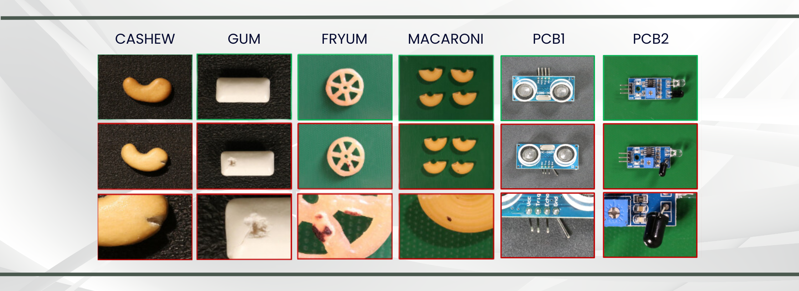
<div>
    <p style="font-size:10px;font-style:default;text-align:center">
        <b>Image 4. Sample Images of the Selected Subsets.</b><br>
    </p>
</div>

| Type | Object | Normal | Anomalous | Anomaly Classes |
| :--: | :--: | :--: | :--: | :--: |
| Single Instance | Cashew | 500 | 100 | 9 |
|  | Chewing Gum | 503 | 100 | 6 |
|  | Fryum | 500 | 100 | 8 |
| Multiple Instances | Macaroni | 1,000 | 100 | 7 |
| Complex Structure | PCB1 | 1,004 | 100 | 4 |
|  | PCB2 | 1,006 | 100 | 4 |

<div>
    <p style="font-size:10px;font-style:default;text-align:center">
        <b>Table 1. Overview of the Selected VisA Subsets.</b>
    </p>
</div>

The sample images show the different images for normal, anomalous, and the segmented anomaly for each of the selected object subsets. There are also three types of objects in this dataset: single instance and multiple instances, both simple structure, and the complex structure.

<span style="color:#4a594f; font-size:18px"><i>Data Preparation</i></span>

The dataset includes images in the Joint Photographic Experts Group (JPEG or JPG) format. However, since the models used in the project can only process images in the Portable Network Graphics (PNG) format, it is necessary to convert the images. The following codes are used to convert the images from JPEG to PNG for both normal and anomalous sets of images per subset.

```python
source_directory = "./cashew/Data/Images/Normal"
destination_directory = "./cashew/normal_png/"

# Create the destination directory if it doesn't exist
if not os.path.exists(destination_directory):
    os.makedirs(destination_directory)

# Iterate over the files in the source directory
for filename in os.listdir(source_directory):
    if filename.endswith(".JPG"):
        # Open the image file
        image_path = os.path.join(source_directory, filename)
        image = Image.open(image_path)

        # Convert and save the image as .png in the destination directory
        new_filename = os.path.splitext(filename)[0] + ".png"
        destination_path = os.path.join(destination_directory, new_filename)
        image.save(destination_path, "PNG")

        print(f"Converted {filename} to {new_filename} and saved to {destination_directory}")
```

```python
source_directory = "./cashew/Data/Images/Anomaly/"
destination_directory = "./cashew/anomaly_png/"

# Create the destination directory if it doesn't exist
if not os.path.exists(destination_directory):
    os.makedirs(destination_directory)

# Iterate over the files in the source directory
for filename in os.listdir(source_directory):
    if filename.endswith(".JPG"):
        # Open the image file
        image_path = os.path.join(source_directory, filename)
        image = Image.open(image_path)

        # Convert and save the image as .png in the destination directory
        new_filename = os.path.splitext(filename)[0] + ".png"
        destination_path = os.path.join(destination_directory, new_filename)
        image.save(destination_path, "PNG")

        print(f"Converted {filename} to {new_filename} and saved to {destination_directory}")
```

After this, the images are resized to 256 x 256 pixels, before splitting the data into training (60%), validation (20%), and test (20%) sets in preparation for the model training. The following codes are used for the resize and then for the data split.

```python
from anomalib.data.folder import Folder
from anomalib.data.task_type import TaskType

datamodule = Folder(
    root=Path.cwd() / "cashew",
    normal_dir="normal_png",
    abnormal_dir="anomaly_png",
    normal_split_ratio=0.2,
    image_size=(256, 256),
    train_batch_size=32,
    eval_batch_size=32,
    task=TaskType.CLASSIFICATION,
)
datamodule.setup()  # Split the data to train/val/test/prediction sets.
datamodule.prepare_data()  # Create train/val/test/predic dataloaders

i, data = next(enumerate(datamodule.val_dataloader()))
print(data.keys())
```

```python
# Check image size
print(data["image"].shape)
```

<span style="color:#4a594f; font-size:18px"><i>Feature Extraction</i></span>

As mentioned earlier, the team prepared two models for this study: `Cflow` and `Padim`, having an expected input size of 256 x 256 images, backbone architecture of `resnet18`, and selected layers for feature extraction. Layers 1, 2, and 3 are selected to represent different levels of abstraction in the feature hierarchy of the backbone, to capture various levels of details in the input images. The creation of the instance of the models from the `anomalib.models` used the following code:

```python
from anomalib.models import Cflow

model = Cflow(
    input_size=(256, 256),
    backbone="resnet18",
    layers=["layer1", "layer2", "layer3"],
)
```

A list of callbacks to be used for the anomaly detection task at hand is also defined in the following code snippet used for configuring metrics, checkpoint, post-processing, normalization, and export-to-inference options. `MetricsConfigurationCallback` configures the metrics for the model evaluation specifying Area Under the Receiver Operating Characteristic curve or AU-ROC, and Area Under the Precision-Recall curve or AU-PR.

`ModelCheckpoint` saves the model’s weights during training such as the scores from the evaluation metric mentioned above. `PostProcessingConfigurationCallback` configures the post-processing methods to be used for anomaly detection, specifying the normalization method to be used as MinMax (also defined in the `MinMaxNormalizationCallback` and the threshold method as adaptive thresholding. Lastly, `ExportCallback` exports the trained model for inference specifying the expected input size, the directory path, and the export mode which is OpenVino (`OPENVINO`).

```python
from anomalib.data.folder import Folder
from anomalib.data.task_type import TaskType

from anomalib.post_processing import NormalizationMethod, ThresholdMethod
from anomalib.utils.callbacks import (
    MetricsConfigurationCallback,
    MinMaxNormalizationCallback,
    PostProcessingConfigurationCallback,
)
from anomalib.utils.callbacks.export import ExportCallback, ExportMode

callbacks = [
    MetricsConfigurationCallback(
        task=TaskType.CLASSIFICATION,
        image_metrics=["AUROC", "AUPR"]
    ),
    ModelCheckpoint(
        mode="max",
        monitor="image_AUROC",
        \
    ),
    PostProcessingConfigurationCallback(
        normalization_method=NormalizationMethod.MIN_MAX,
        threshold_method=ThresholdMethod.ADAPTIVE,
    ),
    MinMaxNormalizationCallback(),
    ExportCallback(
        input_size=(256, 256),
        dirpath=str(Path.cwd()),
        filename="model",
        export_mode=ExportMode.OPENVINO,
    ),
]
```

<span style="color:#4a594f; font-size:18px"><i>Model Training</i></span>

The model training comes next, using the following code snippets. The parameters include (1) `callbacks` which are defined in the preceding code snippet, (2) `accelerator` set to `auto`, automatically choosing the appropriate accelerator based on available hardware and system configuration, (3) `auto_scale_batch_size` set to `False` so the batch size is not automatically adjusted, (4) `check_val_every_n_epoch` set to 1, which means that validation step will be done every epoch, (5) `devices` set to `1`, which means the training will utilize a single device, (6) `gpus` set to `None`, meaning no GPUs will be utilized, (7) `max_epochs` set to `10`, which means the training will run to 10 epochs, (8) `num_sanity_val_steps` set to `0`, which means no validation step will be executed during sanity checks, and (9) `val_check_interval` set to `1.0`, which means a full validation check will be performed after every epoch.

```python
trainer = Trainer(
    callbacks=callbacks,
    accelerator="auto",
    auto_scale_batch_size=False,
    check_val_every_n_epoch=1,
    devices=1,
    gpus=None,
    max_epochs=10,
    num_sanity_val_steps=0,
    val_check_interval=1.0,
)
trainer.fit(model=model, datamodule=datamodule)
```

`trainer.fit` starts the training process, with parameters `model` calling `model` as the instance `Cflow` and `datamodule` calling the `datamodule` as the input data folder.

<span style="color:#4a594f; font-size:18px"><i>Model Evaluation</i></span>

As defined earlier, the metrics to be used for the evaluation of the models are AU-PR and AU-ROC. These are threshold-agnostic evaluation metrics used typically for anomaly detection and localization [(Defard, et. al., 2020)](https://arxiv.org/pdf/2011.08785.pdf) [(Gudovskiy, et. al, 2021)](https://arxiv.org/pdf/2107.12571.pdf) tasks.

AU-PR measures the performance of the models based on precision and recall, and the AU-PR score summarizes the trade-off between precision and recall. The higher the score, the better the performance of the model (wherein a score of 1.0 indicates that the model can classify all positive samples without any false positives).

AU-ROC, on the other hand, evaluates the performance of the models based on sensitivity and specificity, and the AU-ROC score summarizes the models' ability to distinguish between positive and negative samples. The higher the score, the better the performance of the model (wherein a score of 1.0 indicates that the model achieves 100% true positive rate or sensitivity).

These are evaluated further against the scores from the [Zou, et. al. (2022)](https://www.ecva.net/papers/eccv_2022/papers_ECCV/papers/136900389.pdf) paper, which basically are the benchmark for our study. The following code snippet is used to determine the metric score for each of the model per object subset.

```python
# Validation
test_results = trainer.test(model=model, datamodule=datamodule)
```

The result from this evaluation determines how well or how accurately our models can predict anomalies from the input images, answering one of the two things we wanted to do.

<span style="color:#4a594f; font-size:18px"><i>Inference</i></span>

Using `OPENVINO`, inference engineering is executed to visualize how well the model predicts anomaly on the test images. The following steps and their corresponding code snippets are done and executed to get the inference results.

* Loading a test image:

```python
from matplotlib import pyplot as plt

image_path = "./cashew/anomaly_png/038.png"
image = read_image(path="./cashew/anomaly_png/038.png")
plt.imshow(image)
```

* Loading the OpenVino model, creating an instance of the `OpenVINOInferencer` responsible for loading and running inference on OpenVino Intermediate Representation or IR model:

```python
openvino_model_path = Path.cwd() / "weights" / "openvino" / "model.bin"
metadata_path = Path.cwd() / "weights" / "openvino" / "metadata.json"
print(openvino_model_path.exists(), metadata_path.exists())
```

```python
inferencer = OpenVINOInferencer(
    path=openvino_model_path,  # Path to the OpenVINO IR model.
    metadata=metadata_path,  # Path to the metadata file.
    device="CPU",  # We would like to run it on an Intel CPU.
)
```

* Performing inference, returning predicted outputs:

```python
print(image.shape)
predictions = inferencer.predict(image=image)
```

* Visualizing inference results, using the `Visualizer` class from `anomalib.post_processing` for a comprehensive visualization (`VisualizationMode.FULL`) and for two types of tasks namely classification and segmentation (`TaskType.CLASSIFICATION` and ‘TaskType.SEGMENTATION`, respectively):

```python
from anomalib.post_processing import Visualizer, VisualizationMode
from PIL import Image

visualizer = Visualizer(mode=VisualizationMode.FULL, task=TaskType.CLASSIFICATION)
output_image = visualizer.visualize_image(predictions)
Image.fromarray(output_image)
```

```python
visualizer = Visualizer(mode=VisualizationMode.FULL, task=TaskType.SEGMENTATION)
output_image = visualizer.visualize_image(predictions)
Image.fromarray(output_image)
```

The `Image.fromarray` method converts the assumed NumPy array representing the visualization result, to a Python Imaging Library or PIL image. The result from this inference determines how well or how accurately our models can segment anomalies from the input images, answering the second question of what we wanted to achieve.

***The entire methodology is done for both `Cflow` and `Padim`, and for each of the selected object subsets (a total of 12 model training notebooks). All the notebooks used for training and inference may be accessed/retrieved through this [Github repository](https://github.com/BJEnrik/proactive_quality_control.git) or this [SharePoint folder](https://aimedu-my.sharepoint.com/personal/byepes_msds2023_aim_edu/_layouts/15/onedrive.aspx?id=%2Fpersonal%2Fbyepes%5Fmsds2023%5Faim%5Fedu%2FDocuments%2FAIM%20MSDS%2FTerm%204%2FML3%2Fproactive%5Fquality%5Fcontrol&ga=1).***

<div style="background-color:#4a594f; padding: 1px;"> </div>

<h1 style="background-color:#4a594f;color:#ffffff;padding:20px">What We Observed</h1>

The proposed methodology for both `Cflow` and `Padim` yield desirable results, being able to classify/predict anomalous images and segment/visualize the anomalous areas within an object/component image. The following are the results for each of the selected object subsets.

<span style="color:#4a594f; font-size:18px"><i>Single Instance</i></span>

<span style="background-color:#4a594f; color:#ffffff; font-size:15px; padding:10px"><i>Cashew</i></span>

Who does not love to have a snack once in a while? If you are looking for a healthy snack, cashew nuts are one of your options. Cashew nuts are an important delicacy and confectionery, native from Brazil yet first introduced in India. These are a kidney- or heart-shaped seeds, with its color varying from bottle green to grayish brown, especially when already dried, and are a good source of bioactive compounds and proteins [(Kluckzkovski & Martins, 2016)](https://www.sciencedirect.com/science/article/abs/pii/B9780123849472001239).

For this subset, we are looking for damages on the dried fruit which are manufactured as ready-to-eat snacks.

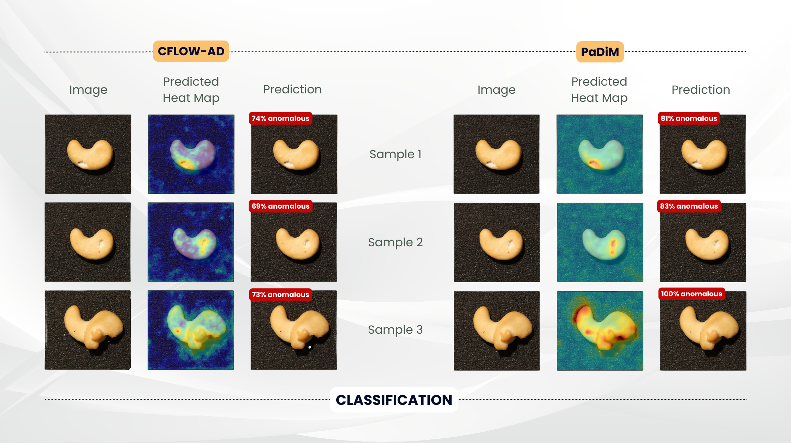
<div>
    <p style="font-size:10px;font-style:default;text-align:center">
        <b>Image 5. Results of Classification for Cashew.</b><br>
    </p>
</div>

`Cflow` and `Padim` gave fairly desirable results for the cashew subset, with the latter predicting Sample 3 (see Image 5) as 100% anomalous. Note that for the predicted heat map, the more red the area is, the more anomalous it is being predicted. This is applicable across all experiments on the different subsequent subsets.

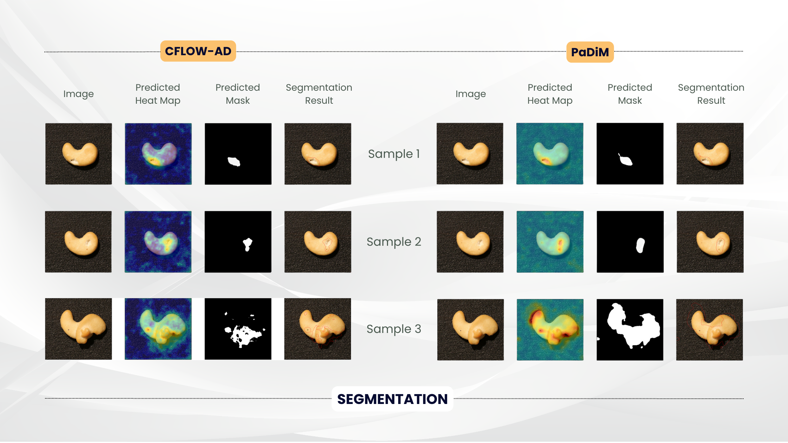
<div>
    <p style="font-size:10px;font-style:default;text-align:center">
        <b>Image 6. Results of Segmentation for Cashew.</b><br>
    </p>
</div>

The segmentation results for both models for the cashew subset are also very good, correctly masking and segmenting the anomalous areas of the component at hand.

| Metric | `Cflow` | `Padim` |
| :--: | :--: | :--: |
| AU-PR | 0.8858 | 0.8824 |
| AU-ROC | 0.8804 | 0.8736 |

<div>
    <p style="font-size:10px;font-style:default;text-align:center">
        <b>Table 2. Model Evaluation for Cashew Subset.</b>
    </p>
</div>

`Cflow` slightly edges out `Padim` for the cashew subset, with `0.88` score for both AU-PR and AU-ROC metrics (see Table 2). Both models are able to classify the anomalous images fairly accurately.

<span style="background-color:#4a594f; color:#ffffff; font-size:15px; padding:10px"><i>Chewing Gum</i></span>

People often have the fixation to do something with their mouth. Eating, smoking, and drinking - all of these activities work the mouth into overdrive. One fix to this overdrive is the chewing gum. A chewing gum is a soft, rubbery substance designed for chewing. It is a candy made by mixing a gum base with sweeteners and flavorings [(West, 2023)](https://www.healthline.com/nutrition/chewing-gum-good-or-bad).

For this subset, similar to the previous one, we are looking at damages to the surface of the gum. Often manufactured as a smooth, glistening item, defects on this component may be easily identified.

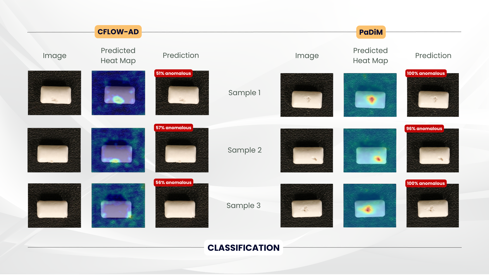
<div>
    <p style="font-size:10px;font-style:default;text-align:center">
        <b>Image 7. Results of Classification for Chewing Gum.</b><br>
    </p>
</div>

`Cflow` and `Padim` gave highly desirable results for the chewing gum subset, with the latter predicting Samples 1 and 3 (see Image 7) as 100% anomalous, with its heat map strongly identifying the anomalous areas.

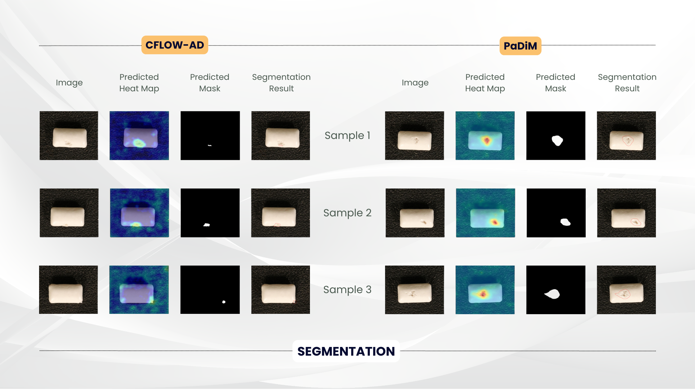
<div>
    <p style="font-size:10px;font-style:default;text-align:center">
        <b>Image 8. Results of Segmentation for Chewing Gum.</b><br>
    </p>
</div>

The segmentation results for both models on the chewing gum subset are highly expedient, with the predicted masks correctly identifying the anomalous areas of the component, resulting to the highly useful segmentation results for this subset.

| Metric | `Cflow` | `Padim` |
| :--: | :--: | :--: |
| AU-PR | 0.9896 | 0.9985 |
| AU-ROC | 0.9860 | 0.9984 |

<div>
    <p style="font-size:10px;font-style:default;text-align:center">
        <b>Table 3. Model Evaluation for Chewing Gum Subset.</b>
    </p>
</div>

Both models have approximated perfection for both evaluation metric, having a 0.99 AU-PR and AU-ROC scores (see Table 3). `Cflow` and `Padim` can classify anomalies in the chewing gum subset almost flawlessly.

<span style="background-color:#4a594f; color:#ffffff; font-size:15px; padding:10px"><i>Fryum</i></span>

Continuing with our fixation with the overworking mouths, let us try to check the fryum subset. Fryums are small flakes that come in circular and star shapes made of rice, tapioca, and potato flour [(Lesson 11: Traditional Food Adjuncts, n.d.)](http://ecoursesonline.iasri.res.in/mod/page/view.php?id=19243). They are cooked through deep-fry and served as a crispy tea-time snack. Again, we love to snack, yes? It is up to you if you would consider this a healthy snack option.

For this subset, we are looking for cracks or loose parts of the fryum shapes.

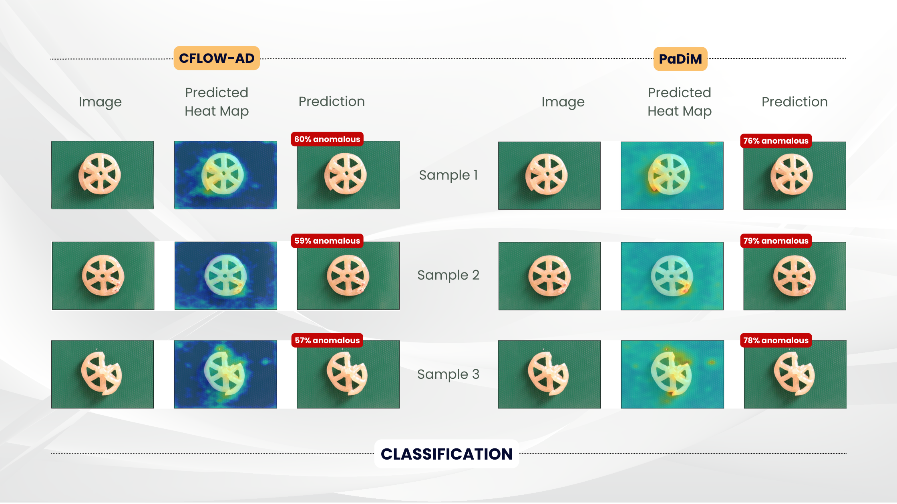
<div>
    <p style="font-size:10px;font-style:default;text-align:center">
        <b>Image 9. Results of Classification for Fryum.</b><br>
    </p>
</div>

Both models, across all the samples examined, classified the anomalous images fairly well. Although, unlike in the previous subsets where `Padim` had identified some of the samples with 100% probability of being anomalous, the highest probability given in this subset is only at 79% (see Image 9).

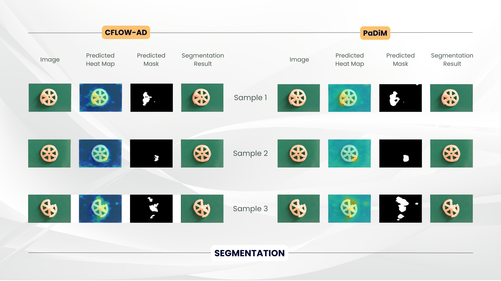
<div>
    <p style="font-size:10px;font-style:default;text-align:center">
        <b>Image 10. Results of Segmentation for Fryum.</b><br>
    </p>
</div>

Similar to the preceding subsets, the segmentation results for both models on the fryum subset are still highly expedient, with the predicted masks correctly identifying the anomalous areas of the component.

| Metric | `Cflow` | `Padim` |
| :--: | :--: | :--: |
| AU-PR | 0.8256 | 0.9021 |
| AU-ROC | 0.7644 | 0.8984 |

<div>
    <p style="font-size:10px;font-style:default;text-align:center">
        <b>Table 4. Model Evaluation for Fryum Subset.</b>
    </p>
</div>

`Padim` is the better model for the fryum subset, at its AU-PR and AU-ROC are nearer `1.0` at the `0.90` range (see Table 4). This means that for fryum subset, `Padim` can classify anomalous images and identify anomalous pixels more accurately than `Cflow`.

<span style="color:#4a594f; font-size:18px"><i>Multiple Instances</i></span>

<span style="background-color:#4a594f; color:#ffffff; font-size:15px; padding:10px"><i>Macaroni</i></span>

Moving on to a main course, let us take a look at the macaroni subset. Derived from the Italian word *maccheroni*, most probably because of the pronunciation, macaroni is the name for various types of pasta shaped like a long or short tubes, with walls and central holes. It is often cooked in salted water, drained when *al dente*, and served with tomato-based sauces with meat or fish [(La Cucina Italiana, n.d.)](https://www.lacucinaitaliana.com/glossary/maccheroni-pasta?refresh_ce=).

For this hunger-inducing subset, we are looking at raw macaronis and the damages in its surface, often a hole or a chip.

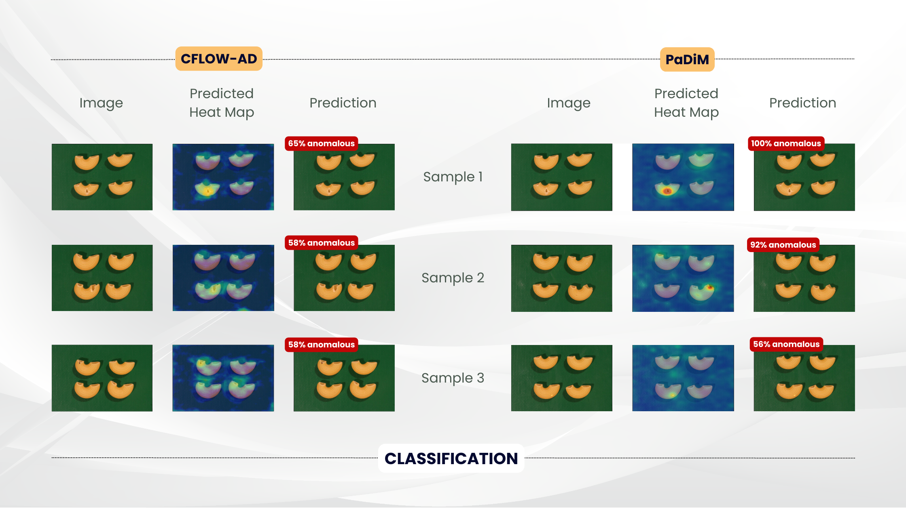
<div>
    <p style="font-size:10px;font-style:default;text-align:center">
        <b>Image 11. Results of Classification for Macaroni.</b><br>
    </p>
</div>

Similar to the preceding subsets, both models, across all the samples examined, classified the anomalous images fairly well, with `Padim` identifying Sample 1 as 100% anomalous (see Image 11).

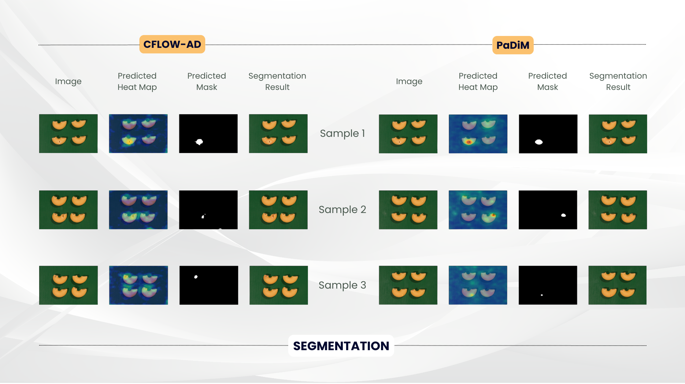
<div>
    <p style="font-size:10px;font-style:default;text-align:center">
        <b>Image 12. Results of Segmentation for Macaroni.</b><br>
    </p>
</div>

Similar to the preceding subsets, the segmentation results for both models on the macaroni subset are fairly good. The challenge here, however, is that there are multiple instances of the component in one image, and the defects are quite small. Both models and their predicted masks have identified these small defects well enough to have fair segmentation results.

| Metric | `Cflow` | `Padim` |
| :--: | :--: | :--: |
| AU-PR | 0.6700 | 0.8021 |
| AU-ROC | 0.7574 | 0.8676 |

<div>
    <p style="font-size:10px;font-style:default;text-align:center">
        <b>Table 5. Model Evaluation for Macaroni Subset.</b>
    </p>
</div>

Similar to the fryum subset, `Padim` is the better model with higher AU-PR and AU-ROC scores. However, the scores are now lower than the previous subsets. Nevertheless, `Padim` can still classify anomalous images and identify anomalous pixels more accurately in this subset than `Cflow`.

<span style="color:#4a594f; font-size:18px"><i>Complex Structure</i></span>

<span style="background-color:#4a594f; color:#ffffff; font-size:15px; padding:10px"><i>PCB1</i></span>

Moving from the fixation of the mouth to the one of the core components in electronics, we take a look at printed circuit boards or PCBs. These are electronic assemblies that use copper conductors to create electrical connections between components [(Peterson, 2020)](https://resources.altium.com/p/what-is-a-pcb). They include a specific set of steps that aligns the purpose it will be used for.

For this subset, we are looking at a number of components at once in an image. That is, there could be multiple defects in a single image of the PCB, and we want our models to detect all of these defects accurately.

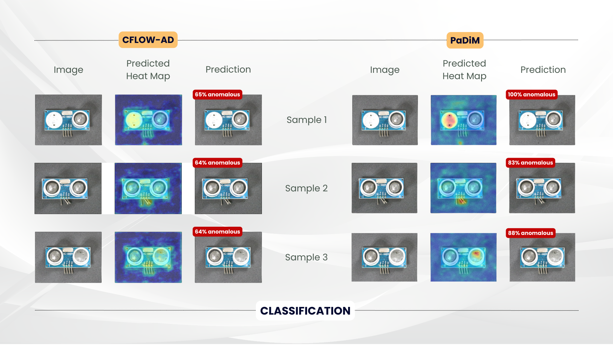
<div>
    <p style="font-size:10px;font-style:default;text-align:center">
        <b>Image 13. Results of Classification for PCB 1.</b><br>
    </p>
</div>

Similar to the preceding subsets, both models, across all the samples examined, classified the anomalous images fairly well, with `Padim` identifying Sample 1 as 100% anomalous (see Image 13).

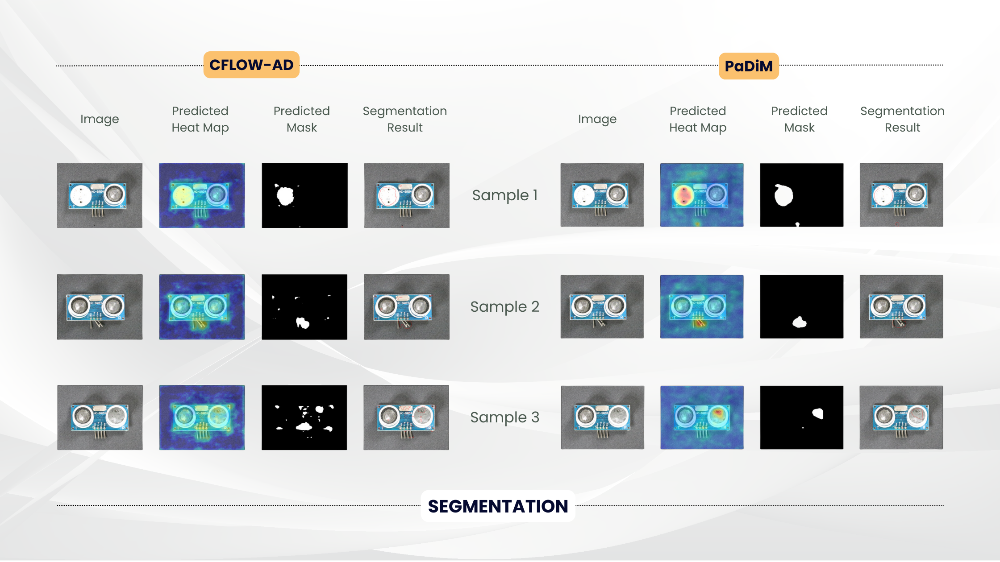
<div>
    <p style="font-size:10px;font-style:default;text-align:center">
        <b>Image 14. Results of Segmentation for PCB 1.</b><br>
    </p>
</div>

Similar to the preceding subsets, the segmentation results for both models on the PCB1 subset are fairly good. Again, the challenge here is detecting all of the defects in the PCB with its different components at once.

| Metric | `Cflow` | `Padim` |
| :--: | :--: | :--: |
| AU-PR | 0.5951 | 0.7431 |
| AU-ROC | 0.7222 | 0.8975 |

<div>
    <p style="font-size:10px;font-style:default;text-align:center">
        <b>Table 6. Model Evaluation for PCB 1 Subset.</b>
    </p>
</div>

`Padim` and `Cflow`, compared to the preceding subsets, performed their worst yet with the PCB1 subset. `Padim` still beats `Cflow` in terms of the model evaluation scores; that is, it is the better model to use for anomaly detection and localization for this subset as it can classify anomalous images more accurately than how `Cflow` can.

<span style="background-color:#4a594f; color:#ffffff; font-size:15px; padding:10px"><i>PCB2</i></span>

We take a look at another subset of PCBs which the team deemed more complex given the number of components seen in a sample image.

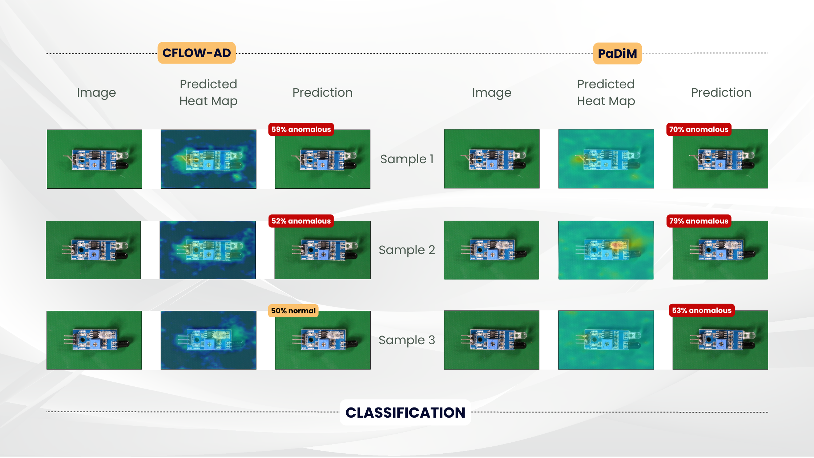
<div>
    <p style="font-size:10px;font-style:default;text-align:center">
        <b>Image 15. Results of Classification for PCB 2.</b><br>
    </p>
</div>

The models have a hard time classifying the anomalous images in this subset, with `Padim` giving only as high as 79% probability to Sample 2. `Cflow` even classified Sample 3 as non-anomalous, at 50% probability of being a normal PCB (see Image 15). Note that these samples are taken from the test set, or the anomalous images set.

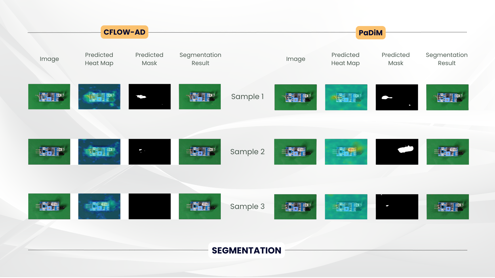
<div>
    <p style="font-size:10px;font-style:default;text-align:center">
        <b>Image 16. Results of Segmentation for PCB 2.</b><br>
    </p>
</div>

With the models having a hard time classifying the anomalous images, they also have a hard time identifying the correct areas or pixels in the image representative of the defect, with `Cflow` predicting no anomalies for Sample 3 (see Image 16)

| Metric | `Cflow` | `Padim` |
| :--: | :--: | :--: |
| AU-PR | 0.4717 | 0.5665 |
| AU-ROC | 0.6893 | 0.7452 |

<div>
    <p style="font-size:10px;font-style:default;text-align:center">
        <b>Table 7. Model Evaluation for PCB 2 Subset.</b>
    </p>
</div>

As expected, the model evaluation metric scores for this subset for both models are the worst. The best score is `0.75` AU-ROC for `Padim`, indicating less sensitivity of the model for this subset. `Cflow` having a `0.47` AU-PR score indicates there may be a higher false positives in its classification of the anomalous images.

<span style="color:#4a594f; font-size:18px"><i>Overall Results</i></span>

| Metric | `PaDiM` | `Cflow` | `SimSiam` | `MoCo` | `SimCLR` | 
| :--: | :--: | :--: | :--: | :--: | :--: |
| AU-PR | 0.816 | 0.737 | 0.828 | <b>0.841</b> | 0.839 |
| AU-ROC | <b>0.880</b> | 0.800 | 0.812 | 0.830 | 0.826 |

<div>
    <p style="font-size:10px;font-style:default;text-align:center">
        <b>Table 8. Comparison of Results with the Benchmark Models.</b>
    </p>
</div>

Table 8 shows the average model evaluation scores of different models used for anomaly detection and localization. `Padim` and `Cflow` are part of our implementation, while `SimSiam`, `MoCo`, and `SimCLR` are from the `SPD` or SPot-the-Difference study by Zou, et. al. in 2022.

In terms of the precision-recall curve, our implementation was not able to beat the benchmark, although `Padim` came close at `0.8` mark, the same range of the benchmarks. `Padim`, however, beats the benchmark in terms of sensitivity rate, having an AU-ROC score of `0.88`, a `0.05` difference from `MoCo`.

<h1 style="background-color:#4a594f;color:#ffffff;padding:20px">What We Took Away</h1>

Referring to Table 8, our overall implementation of `Padim` and `Cflow` are an effective implementation of anomaly detection and localization. The model evaluation metric scores are comparable to our set benchmark, with `Padim` beating out every model in terms of sensitivity rate. Hence, our implementation is as effective as, if not more effective than, the implementation of our benchmark models.

Focusing on each of the subset, the team states that there is no one-model-fits-all for this anomaly detection task. With our experiment involving six out of the twelve subsets of the VisA dataset, we see how `Padim` and `Cflow`'s performances change for each subset. If we were to be asked then what the rule to thumb is in selecting the better model for a certain object, the team states that for simpler objects or components such as chewing gum and cashew, any of the models can be used and will provide fairly accurate results. For more complex objects, however, `Padim` is the better model to use as it exemplifies high sensivity across all subsets while maintaining high accuracy in terms of classifying anomalous images.

The inference time for these models, for the size of the subsets, is quite fast. Thus, in terms of deployability, it is highly possible. However, note that the team trained the models for only ten epochs across all the selected subsets. This low number of epochs is due to the limitations of the machines used for training (our personal machines). Thus, in order to have more training epochs which can further improve the results of the study, the implementation of the models will require a higher investment, for instance, on machine requirements. The trade-off between computational efficiency and its cost is at play.

<span style="color:#4a594f; font-size:18px"><i>Future Work</i></span>

For proponents looking for a project and interested in taking this to the next level, the team recommend to compare the anomaly detection performance of the models presented with reconstruction-based methods (mentioned in [Zou, et. al., 2022](https://www.ecva.net/papers/eccv_2022/papers_ECCV/papers/136900389.pdf)). As mentioned earlier as well, the team recommend to train the models further with a higher number of epochs which could give better results. Lastly, future works may also include the exploration of other XAI visual techniques to see if there are other inference engines that can be used for the localization tasks. The techniques to be explored may include integrated gradients and attention mechanisms.

<div style="background-color:#4a594f; padding: 1px;"> </div>

<span style="color:#4a594f; font-size:15px"><b><i>References</i></b></span>

Abhishek, A. V. S., et. al. (2022, May 5). Resnet18 Model With Sequential Layer For Computing Accuracy On Image Classification Dataset. <i>International Journal of Creative Research Thoughts, 10(5), 2320-2882.</i> https://ijcrt.org/papers/IJCRT2205235.pdf

Amazon Web Services. (n.d.). <i>Visual Anomaly (VisA)</i>. https://registry.opendata.aws/visa/

Defard, T., et. al. (2020, Nov 17). PaDiM: a Patch Distribution Modeling Framework for Anomaly Detection and Localization. https://arxiv.org/pdf/2011.08785.pdf

Github. (n.d.). <i>Anomalib.</i> https://github.com/openvinotoolkit/anomalib

Gudovskiy, D., et. al. (2021, Jul 27). CFLOW-AD: Real-Time Unsupervised Anomaly Detection with Localization via Conditional Normalizing Flows. https://arxiv.org/pdf/2107.12571.pdf

He, K., et. al. (2015, Dec 10). Deep Residual Learning for Image Recognition. https://arxiv.org/pdf/1512.03385v1.pdf

Kluczkovski, A. M. & Martins, M. (2016). Cashew Nuts. <i>Encyclopedia of Food and Health, 683-686.</i> https://doi.org/10.1016/B978-0-12-384947-2.00123-9

La Cucina Italiana. (n.d.). <i>Glossary – Maccheroni pasta.</i> https://www.lacucinaitaliana.com/glossary/maccheroni-pasta?refresh_ce=

Lesson 11: Traditional Food Adjuncts. (n.d.). Convenience and Health Foods 3 (1+2). https://www.healthline.com/nutrition/chewing-gum-good-or-bad

Meel, V. (n.d.). What is OpenVINO? – The Ultimate Overview in 2023. <i>viso.ai</i>. https://viso.ai/computer-vision/intel-openvino-toolkit-overview/

Peterson, Z. (2020, Oct 5). What is a PCB? <i>Altium.</i> https://resources.altium.com/p/what-is-a-pcb

Philippine Statistics Authority (PSA). (2022, Oct 11). <i>Highlights of the Philippine Export and Import Statistics August 2022 (Preliminary)</i>. https://psa.gov.ph/content/highlights-philippine-export-and-import-statistics-august-2022-preliminary

Statista Research Department. (2023, Mar 9). Export share of semiconductors Philippines 2020-2022. https://www.statista.com/statistics/1264606/philippines-export-share-of-semiconductors

West, H. (2023, May 4). Chewing Gum: Good or Bad? <i>healthline</i>. https://www.healthline.com/nutrition/chewing-gum-good-or-bad

Zou, Y., et. al. (2022, Jul 28). SPot-the-Difference Self-Supervised Pre-training for Anomaly Detection and Segmentation. https://www.ecva.net/papers/eccv_2022/papers_ECCV/papers/136900389.pdf

---

<span style="color:#4a594f; font-size:15px"><b><i>Generative AI Documentation</i></b></span>

ChatGPT aided the development of this notebook/blog post through the following:
* annotation of the code used in the model training notebooks
* initial brief definition of terms (e.g., JPEG, PNG, AU-PR, AU-ROC) before confirming with in-text references
* improvement to the few statements (limited to one to two) within the blog post
* markdown syntax confirmation

<div style="background-color:#4a594f; padding: 1px;"> </div>
